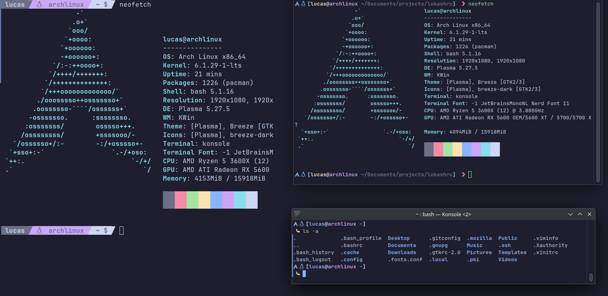

# Bash Configuration

  

To use this configuration, copy and paste the contents in my .bashrc to your local .bashrc file.  
The default path to .bashrc on Linux is:
```/home/[user]/.bashrc```

Read code comments and change colors and icons to your liking, or keep my defaults!

## 🔎 Search for your terminal emulator and dowload Catpuccin here:  
[Cattpuccin](https://github.com/catppuccin/catppuccin)

## 🤓 Install a Nerd Font for icons (I use JetBrains without ligatures):  
[Nerd Fonts](https://www.nerdfonts.com/#home)

